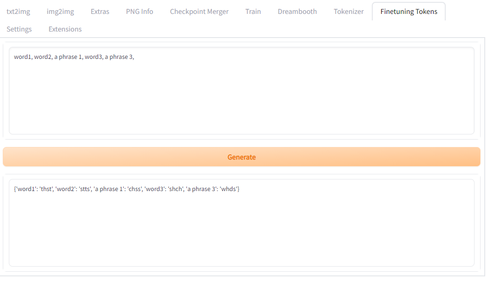

A simple extension for web-ui to generate unique tokens for dreambooth/finetuning which are unlikely to conflict with existing concepts in the stable diffusion model.

It creates a token out of an existing partial word + word in [the CLIP vocab](https://huggingface.co/runwayml/stable-diffusion-v1-5/raw/main/tokenizer/vocab.json)

It deprioritizes words with vowels or the letter y, and has a set list of known acronyms to avoid to increase the chances of generating a rare token. It avoids using the same sub-components in multiple tokens when generating a list of tokens.

The final result is printed in a python dictionary format so that it is very easy to slot into any stable diffusion build as a text replacer on a prompt, during training or inference.
